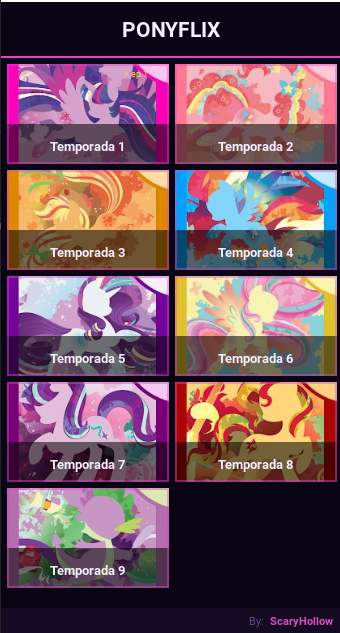
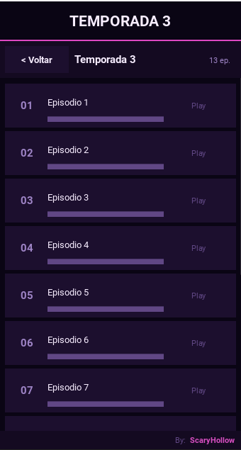
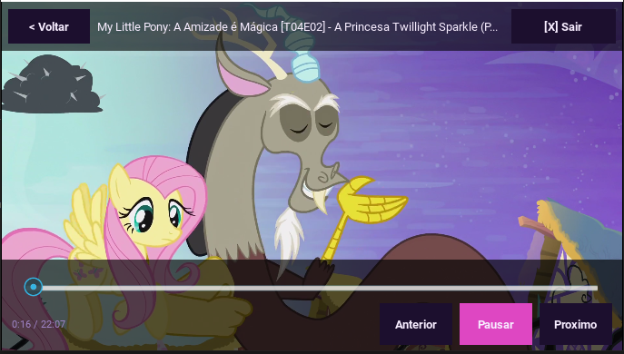

# Ponyflix

Um app de streaming de **My Little Pony** feito em Python com Kivy. Puxa os episódios direto do [pony.tube](https://pony.tube) via API — sem abrir browser, sem redirect, direto no player.

Roda no PC e também gera APK pra Android.

---

## Funcionalidades

- 🎬 Streaming direto dos episódios em qualidade máxima disponível
- 📺 9 temporadas com capas personalizadas em grade responsiva
- 💾 Salva o progresso por episódio e retoma de onde parou
- ⏭️ Avança automaticamente pro próximo episódio ao terminar
- 🖥️ Modo tela cheia no player
- 📱 Interface responsiva — funciona em celular, tablet e PC

---

## Telas

<div align="center">





</div>

---

## Como rodar

```bash
pip install -r requirements.txt
python Ponyflix.py
```

A estrutura de arquivos precisa estar assim:

```
PonyFlix/
├── Ponyflix.py
├── episodios.json
├── requirements.txt
└── assets/
    ├── t1.png  ← capa da temporada 1
    ├── t2.png
    ├── ...
    └── t9.png
```

---

## Gerando APK pra Android

Use o Buildozer no linux, `buildozer.spec` incluso.

---

## Atualizando a lista de episódios

Se sair temporada nova ou quiser recriar o `episodios.json`, é so seguir a lógica:


## Stack

- [Python 3.10+](https://python.org)
- [Kivy 2.3](https://kivy.org) — framework de UI
- [Pillow](https://python-pillow.org) — processamento de imagens
- [pony.tube](https://pony.tube) — fonte dos vídeos via API PeerTube

---
